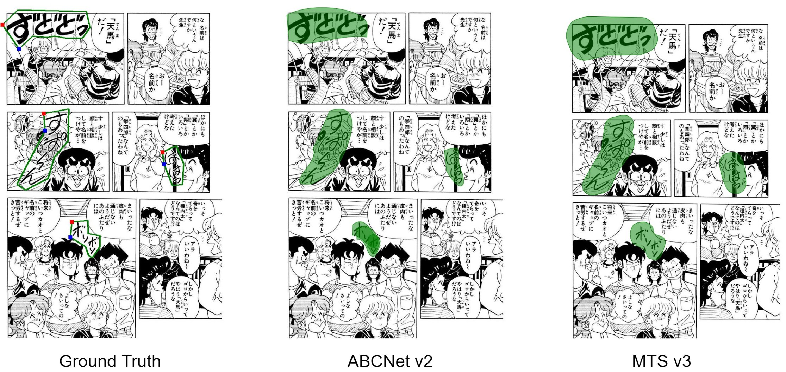
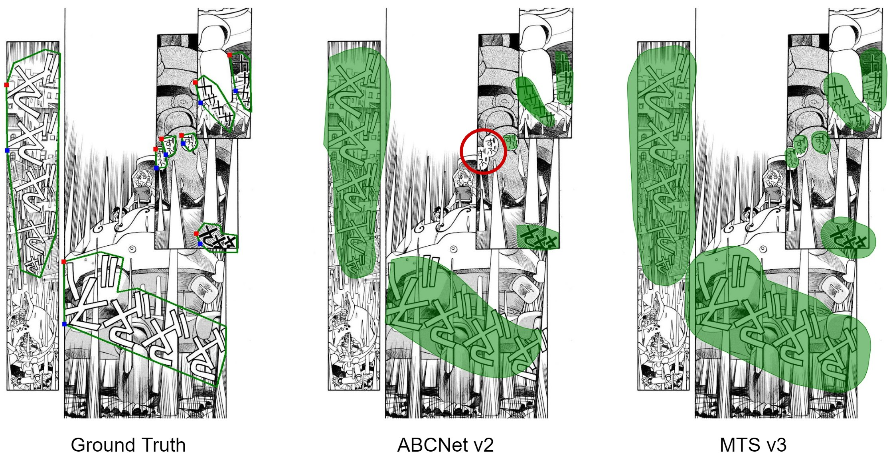

## Visualization
The figures show the ground truth, prediction by ABCNet v2, and prediction by MTS v3, respectively.
The green regions are the predicted regions and the red circles are failures.

<p align="center">
   
</p>

<p align="center">
   
</p>


## Installation
Recommended OS: Linux <br>
Install conda >= 4.11.0  (python >= 3.8) and then run following commands. <br>
(if your conda version is lower than 4.11.0, update conda first, with the command `conda update -n base -c defaults conda`)
```
conda create -n ABCNetv2 python=3.8 -y
conda activate ABCNetv2

pip install torch==1.9.0+cu111 torchvision==0.10.0+cu111 -f https://download.pytorch.org/whl/torch_stable.html
python -m pip install detectron2==0.5 -f \
  https://dl.fbaipublicfiles.com/detectron2/wheels/cu111/torch1.9/index.html

pip install opencv-python
python setup.py build develop
```

## Dataset
Run [data_for_ABCNetv2.ipynb](https://github.com/ku21fan/COO-Comic-Onomatopoeia/blob/main/COO-data/data_for_ABCNetv2.ipynb) in the COO-data folder to make train/val/test data.

## Pretrained models
Download the pretrained models in [Dropbox](https://www.dropbox.com/sh/lx61z7gq5yzkp02/AAAEyzVuVqVy_-EvtqTOJTaXa?dl=0)

## Demo with pretrained model [ABCNetv2.pth](https://www.dropbox.com/s/cg63gsnf7741vjw/ABCNetv2.pth)
```
CUDA_VISIBLE_DEVICES=0 python demo/demo.py --config-file configs/eval.yaml \
--input demo_images/test/ --output demo_results/test/ --opts MODEL.WEIGHTS ABCNetv2.pth
```


## Training (= Finetune)
Check the initial weights in the config file.
We finetune the model from the trained model on CTW1500 ([ABCNetv2_CTW1500_finetuned_model.pth](https://www.dropbox.com/s/yzmh2dw3acg0445/ABCNetv2_CTW1500_finetuned_model.pth))

```
CUDA_VISIBLE_DEVICES=0,1,2,3 OMP_NUM_THREADS=1 python3 train_net.py --config-file configs/COO_default.yaml \
--num-gpus 4 SEED 456 OUTPUT_DIR output/seed456
```


## Evaluation (detection only)
#### Check the config file ([configs/eval.yaml](https://github.com/ku21fan/COO-Comic-Onomatopoeia/blob/main/ABCNetv2/configs/eval.yaml)) for some parameters.
test dataset: ```DATASETS.TEST```;
input size: ```INPUT.MIN_SIZE_TEST```;
output directory: ```OUTPUT_DIR```

test by using the pretrained model [ABCNetv2.pth](https://www.dropbox.com/s/cg63gsnf7741vjw/ABCNetv2.pth)
```
CUDA_VISIBLE_DEVICES=0 python train_net.py --eval-only --num-gpus 1 --config-file configs/eval.yaml MODEL.WEIGHTS ABCNetv2.pth
```


## Citing AdelaiDet

If you use this toolbox in your research or wish to refer to the baseline results published here, please use the following BibTeX entries:

```BibTeX

@misc{tian2019adelaidet,
  author =       {Tian, Zhi and Chen, Hao and Wang, Xinlong and Liu, Yuliang and Shen, Chunhua},
  title =        {{AdelaiDet}: A Toolbox for Instance-level Recognition Tasks},
  howpublished = {\url{https://git.io/adelaidet}},
  year =         {2019}
}
```
and ABCNetv2:
```BibTeX
@ARTICLE{9525302,
  author={Liu, Yuliang and Shen, Chunhua and Jin, Lianwen and He, Tong and Chen, Peng and Liu, Chongyu and Chen, Hao},
  journal={IEEE Transactions on Pattern Analysis and Machine Intelligence}, 
  title={ABCNet v2: Adaptive Bezier-Curve Network for Real-time End-to-end Text Spotting}, 
  year={2021},
  volume={},
  number={},
  pages={1-1},
  doi={10.1109/TPAMI.2021.3107437}
}
```

## License

For academic use, this project is licensed under the 2-clause BSD License - see the LICENSE file for details. For commercial use, please contact [Chunhua Shen](mailto:chhshen@gmail.com).

## Acknowledgements
This implementation has been based on the repository [ABCNetv2 (part of AdelaiDet)](https://github.com/aim-uofa/AdelaiDet/tree/master/configs/BAText).
