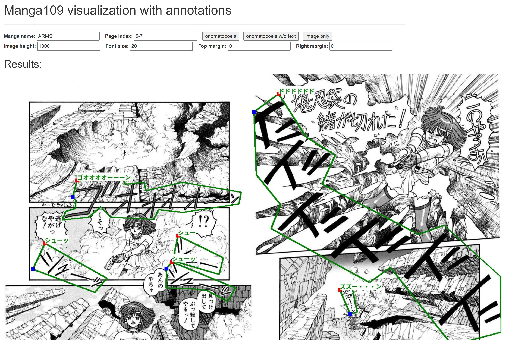

## Annotations of COO
In this repository, we keep the annotations used for the ECCV submission.
This is the same version of [v2022.07.07](https://github.com/manga109/public-annotations/tree/main/COO-Comic-Onomatopoeia/v2022.07.07) of the [Manga109 public-annotations](https://github.com/manga109/public-annotations) repository.

## Preprocessing codes (jupyter notebook) for each model
To prepare the data for ABCNetv2, MTSv3, and TRBA, use `data_for_ABCNetv2.ipynb`, `data_for_MTSv3.ipynb`, and `data_for_TRBA.ipynb`, respectivly.  

## Visualization
For data visualization, run `python vis.py`, then the web page made by Flask is running on 0.0.0.0:6006 (or localhost: 6006)   
You can visualize multiple pages by using the format "{start_number}-{end_number}" in the `Page index` field.  
For exmaple, 
- Page index: 2 → Visualize page 2. 
- Page index: 2-5 → Visualize page 2, 3, 4, 5.

## Other files
`annotations` folder contains the annotation data of COO.  
`books*.txt` contains the book titles of Manga109 data.  
`Onomatopoeia_train_char_set.txt` contains the character set of train data.  

For data analysis, use `data_analysis.ipynb`  
