## Samples of COO
We show some samples of annotated images.  
🟢 Green polygon: the region of onomatopoeia  
🟣 Purple line: the link between truncated texts  
🟥 Red and 🟦 blue squares: the start and end points of each annotation, respectively  
The name of each sample is `annotated_{name of comics}_page{page number}`  

annotated_Akuhamu_page74    ©Arai Satoshi

annotated_BakuretsuKungFuGirl_page43    ©Ueda Miki
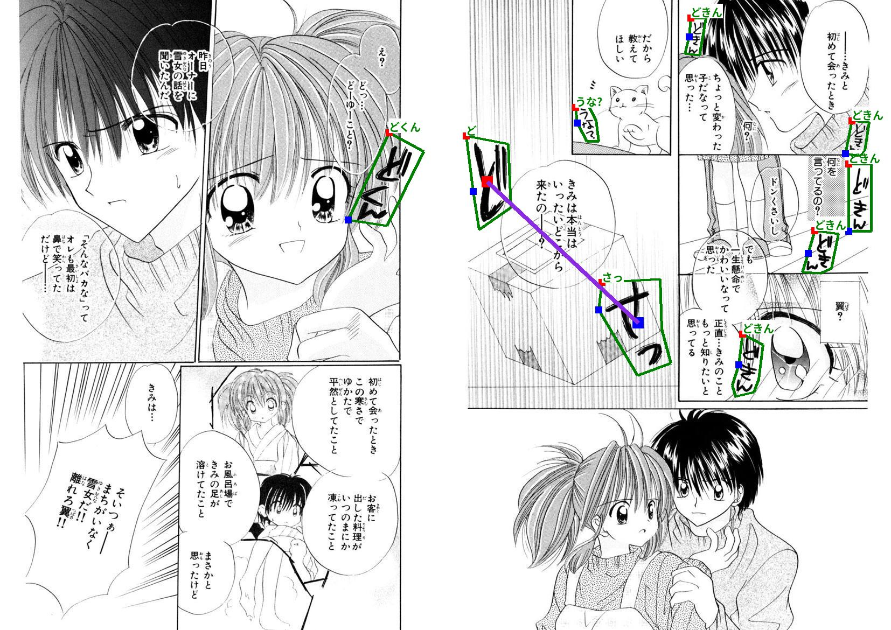

annotated_BakuretsuKungFuGirl_page70    ©Ueda Miki
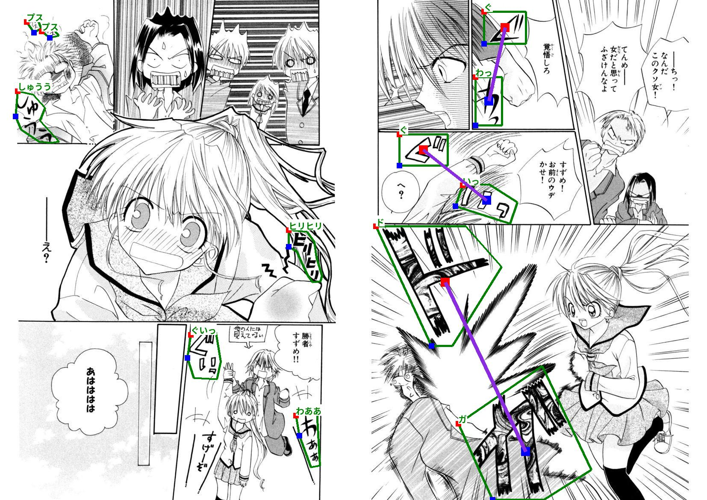

annotated_BEMADER_P_page29    ©Hasegawa Yuichi
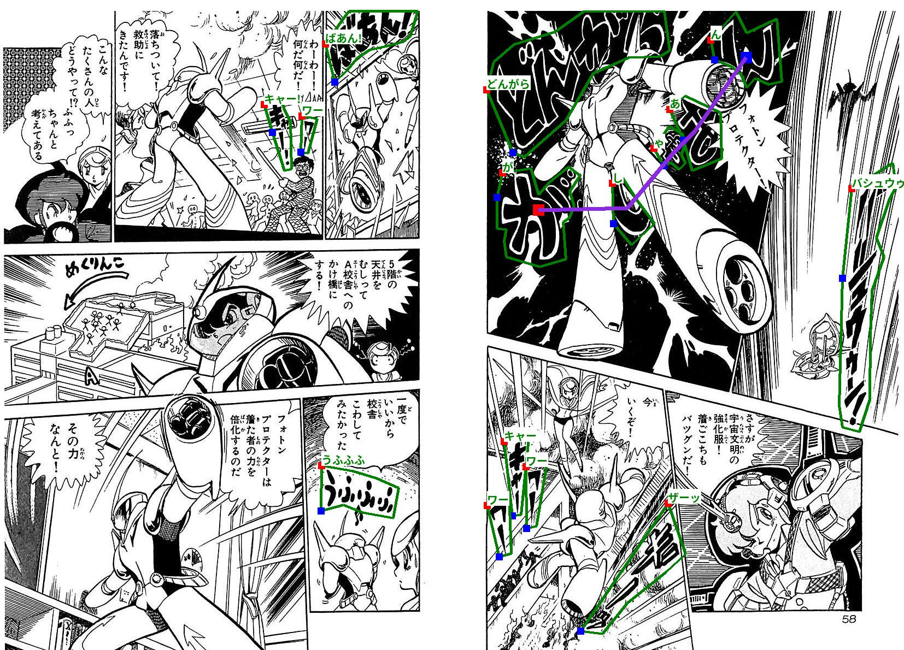

annotated_ByebyeC-BOY_page35    ©Aida Mayumi
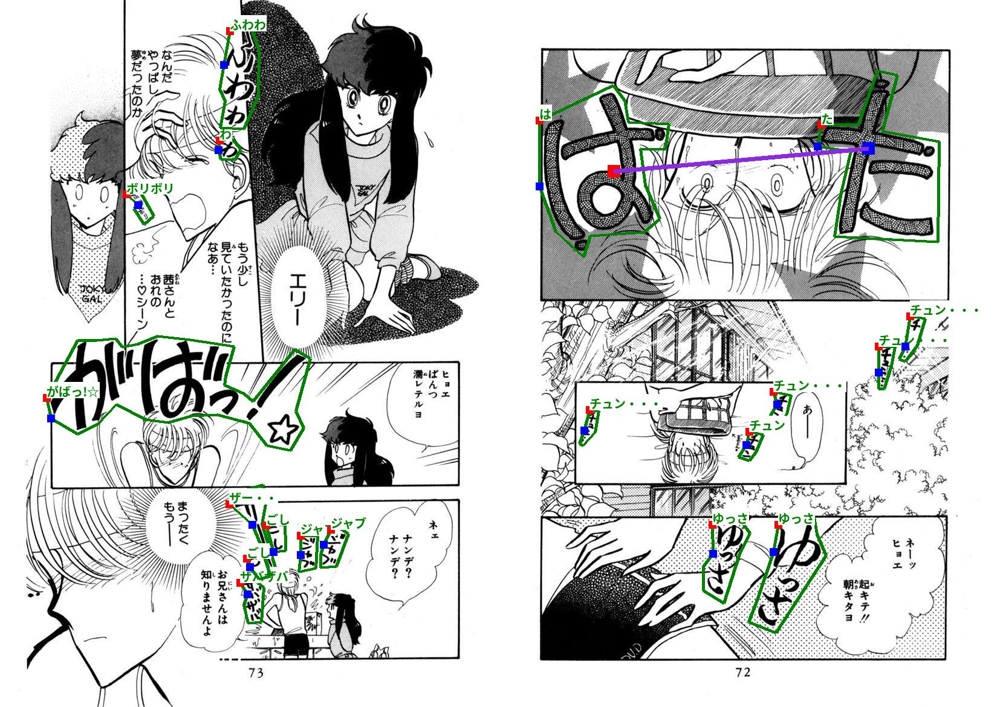

annotated_HanzaiKousyouninMinegishiEitarou_page94   ©Ki Takashi
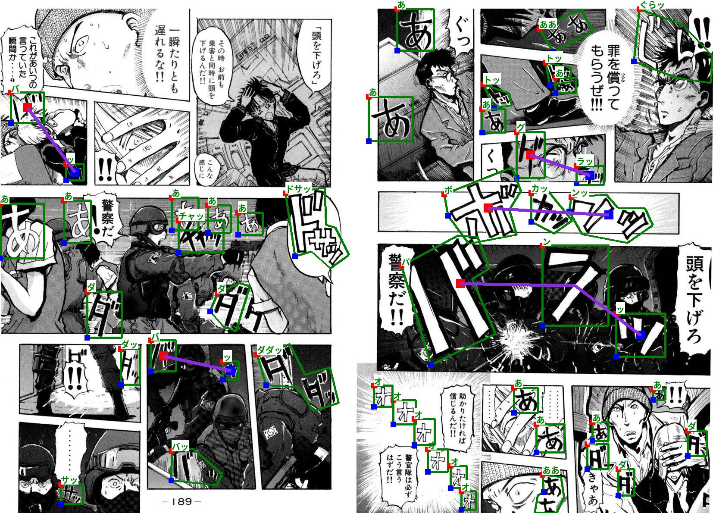

annotated_HighschoolKimengumi_vol01_page8   ©Shinzawa Motoei
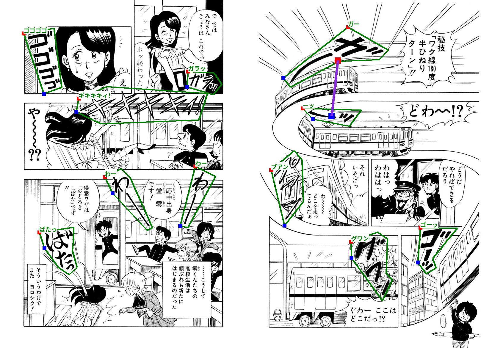

annotated_HighschoolKimengumi_vol01_page77    ©Shinzawa Motoei
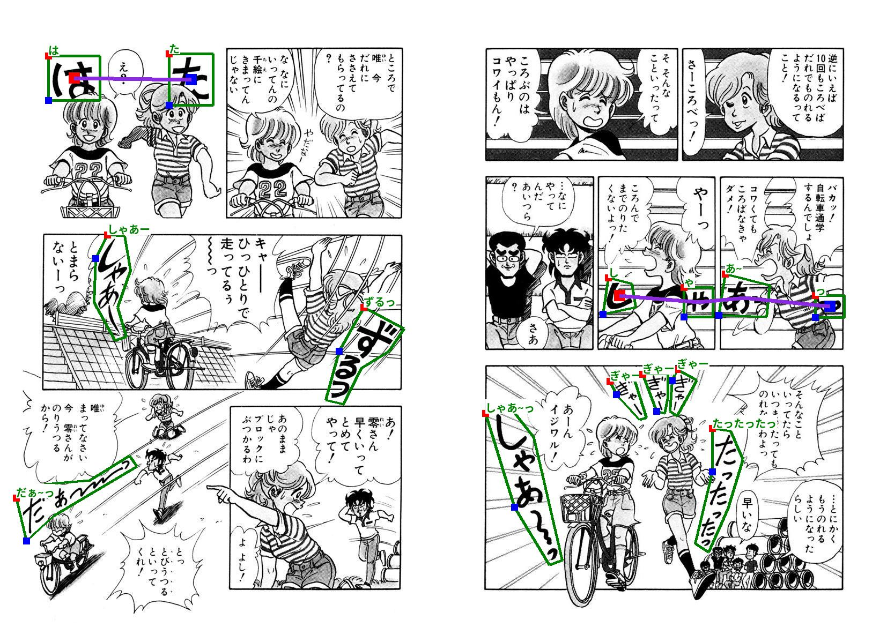

annotated_Joouari_page10    	©Oi Masakazu
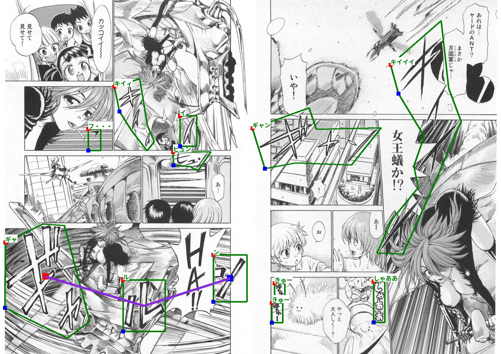

annotated_Nekodama_page104    	©Ebihurai
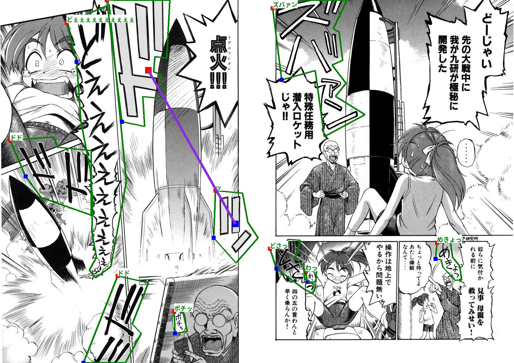

annotated_NichijouSoup_page5    ©Shindou Uni
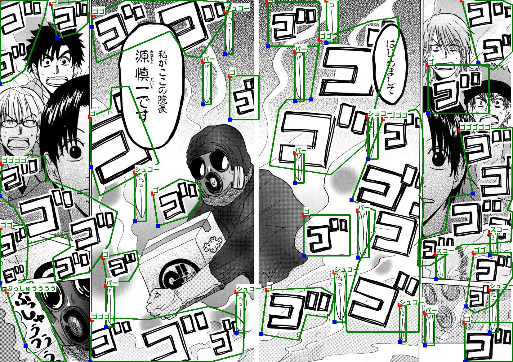

annotated_PsychoStaff_page43    ©Mizukami Satoshi
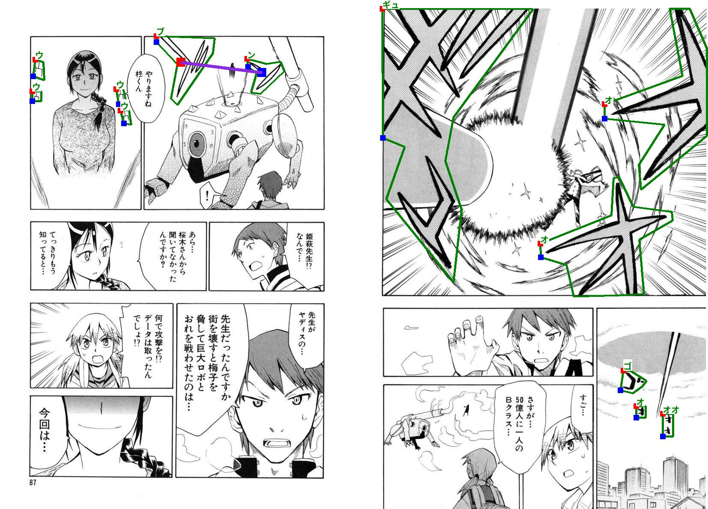

annotated_PsychoStaff_page44    ©Mizukami Satoshi
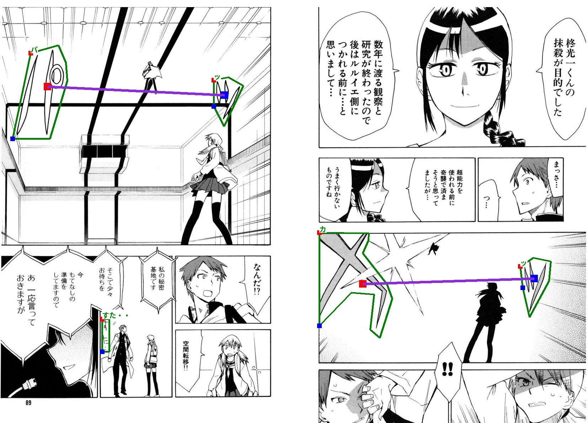

annotated_PsychoStaff_page47    ©Mizukami Satoshi
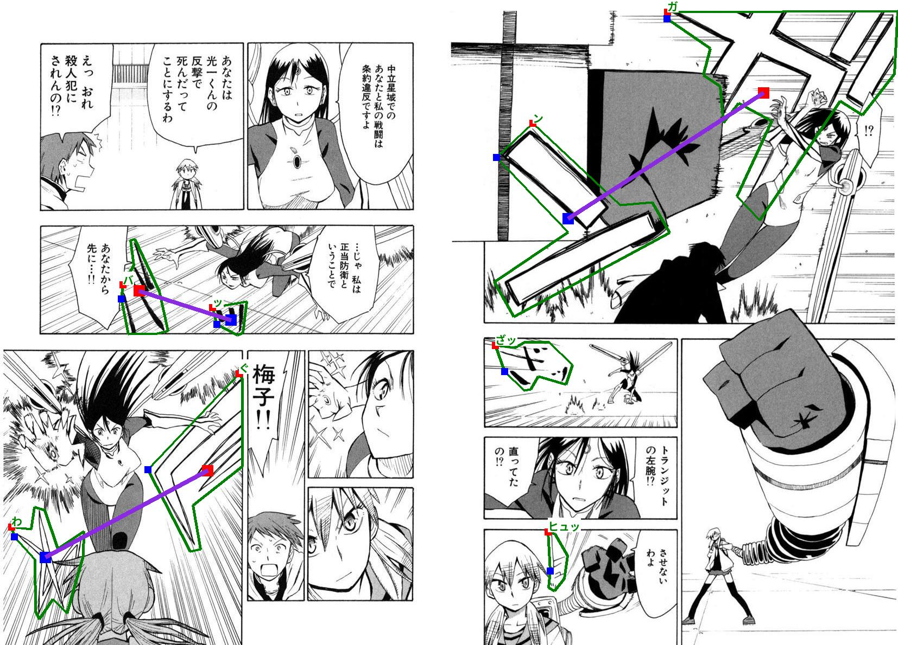

annotated_TaiyouNiSmash_page57    	©Ayumi Yui

