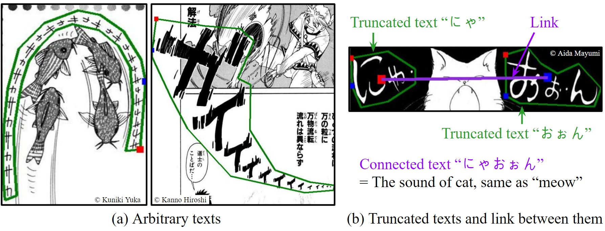
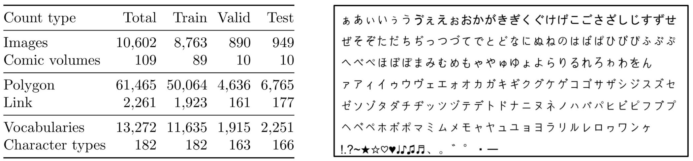

# COO: Comic Onomatopoeia Dataset for Recognizing Arbitrary or Truncated Texts
We provide the COmic Onomatopoeia dataset (COO) and the source codes used in our paper. <br>
1. COO has many arbitrary texts, such as extremely curved, partially shrunk texts, or arbitrarily placed texts.
Furthermore, some texts are separated into several parts.
Each part is a truncated text and is not meaningful by itself.
These parts should be linked to represent the intended meaning.
Thus, we propose a novel task that predicts the link between truncated texts.

2. COO is a challenging text dataset.
Detecting the onomatopoeia region and capturing the intended meaning of truncated texts are very difficult. 
If a model can recognize comic onomatopoeias, we expect that the model can also recognize other less difficult texts.
We hope our work will encourage studies on more irregular texts and further improve text detection, recognition, and link prediction methods. <br>

<br>
<p align="center">
   
</p>

## Dataset: Comic Onomatopoeia (COO)
We provide the [annotations of the COO](https://github.com/ku21fan/COO-Comic-Onomatopoeia/tree/main/COO-data/annotations). <br>
Several files that help preprocessing, visualization, and data analysis are in [COO-data](https://github.com/ku21fan/COO-Comic-Onomatopoeia/tree/main/COO-data) folder. <br>
COO has 61,465 polygons and 2,261 links between truncated texts. <br>
The below figure shows the COO statistics and character types of COO (182 types in total). <br>

<p align="center">
   
</p>


#### Prerequisites: Download Manga109 images
Following [the license of Manga109](http://www.manga109.org/en/download.html), the redistribution of the images of Manga109 is not permitted. <br> 
Thus, you should download the images of Manga109 via [Manga109 webpage](http://www.manga109.org/en/download.html). <br> 

After downloading, unzip `Manga109.zip` and then move `images` folder of Manga109 into [COO-data](https://github.com/ku21fan/COO-Comic-Onomatopoeia/tree/main/COO-data) folder. <br>
We need `images` folder in `COO-data` folder (i.e. `COO-data/images`) for preprocessing. 


#### Preprocessing for each model
1. Run the following command.
   ```
   pip install Flask==2.0.2 Shapely==1.8.0 manga109api==0.3.1 pillow natsort lmdb opencv-python numpy tqdm
   ```

2. See the section `dataset` in each model folder.

<br>

## Codes
The source codes used in our paper are provided in each folder. <br>
For text detection, we used ABCNetv2 and MTSv3. <br>
For text recognition, we used TRBA. <br> 
For link prediction, we used M4C-COO (a variant of M4C) <br>

<br>

## Leaderboard
We will list the results of SOTA methods that provide the official code. <br>
For the leaderboard, **we report the performance of one pretrained model.** <br>
Note that we report the average value of three trials in our paper. <br>
We welcome the pull requests containing an official code (URL) of other SOTA methods. <br>


### Text detection
- P: Precision &nbsp;&nbsp;  R: Recall &nbsp;&nbsp;   H: Hmean &nbsp;&nbsp;  *: only use detection part.
- Based on the hmean, methods are sorted in descending order.

| Method | P | R | H | Official Code | Pretrained model |
|:---|:---:|:---:|:---:|:---:|:---:|
| DB (AAAI 2020) | 90.9 | 60.3 | 72.5 | [URL](https://github.com/MhLiao/DB) | [download](https://www.dropbox.com/s/b4zqiknn7i9kxqw/DB_pretrain_COO) | 
| PAN (ICCV 2019) | 88.4 | 58.6 | 70.4 | [URL](https://github.com/whai362/pan_pp.pytorch) | [download](https://www.dropbox.com/s/6vbc7m6o4695336/PAN_pretrain_COO.pth.tar) | 
| MTSv3* (ECCV 2020) | 70.1 | 66.0 | 68.0 | [URL](https://github.com/MhLiao/MaskTextSpotterV3) | [download](https://www.dropbox.com/s/u0rnep52nshfukx/MTSv3.pth) | 
| ABCNetv2* (TPAMI 2021) | 67.2 | 65.1 | 66.1 | [URL](https://github.com/aim-uofa/AdelaiDet/tree/master/configs/BAText) | [download](https://www.dropbox.com/s/cg63gsnf7741vjw/ABCNetv2.pth) | 


### Text recognition
- Based on the accuracy, methods are sorted in descending order.

| Method | Accuracy | Official Code | Pretrained model |
|:---|:---:|:---:|:---:|
| TRBA+2D (ours) | 81.2 | [URL](https://github.com/ku21fan/COO-Comic-Onomatopoeia/tree/main/TRBA) | [download](https://www.dropbox.com/s/bifm6a2rktl6s60/TRBA_Rot%2BSAR%2BHardROIhalf%2B2D.pth) | 
| MASTER (PR 2021) | 74.6 | [URL](https://github.com/wenwenyu/MASTER-pytorch) | [download](https://www.dropbox.com/s/pp3gutk4xofokny/MASTER_pretrain_COO.pth) | 
| ABINet w/o pretrain (CVPR 2021) | 70.6 | [URL](https://github.com/FangShancheng/ABINet) | [download](https://www.dropbox.com/s/xgfwllru93ncnyp/ABINet_pretrain_COO.pth) | 


### Link prediction
- P: Precision &nbsp;&nbsp;  R: Recall &nbsp;&nbsp;   H: Hmean
- Based on the hmean, methods are sorted in descending order.

| Method | P | R | H | Official Code | Pretrained model |
|:---|:---:|:---:|:---:|:---:|:---:|
| M4C-COO (ours) | 74.5 | 66.3 | 70.2 | [URL](https://github.com/ku21fan/COO-Comic-Onomatopoeia/tree/main/M4C-COO) | [download](https://www.dropbox.com/s/9gzglorqt0muu5h/M4C-COO_default.ckpt) | 
| M4C-COO with vocab 11640 (ours) | 59.4 | 44.6 | 51.0 | [URL](https://github.com/ku21fan/COO-Comic-Onomatopoeia/tree/main/M4C-COO) | [download](https://www.dropbox.com/s/4vn0jgegu4p6qso/M4C-COO_vocab11640.ckpt) | 
| Distance-based rule (ours) | 1.1 | 74.5 | 2.1 | - | - | 

<br>

## Citation
When using annotations of comic onomatopoeia dataset (COO) or if you find this work useful for your research, please cite our paper.
```
@inproceedings{baek2022COO,
  title={COO: Comic Onomatopoeia Dataset for Recognizing Arbitrary or Truncated Texts},
  author={Baek, Jeonghun and Matsui, Yusuke and Aizawa, Kiyoharu},
  booktitle={Proceedings of the European Conference on Computer Vision (ECCV)},
  year={2022}
}
```

## Contact
Feel free to contact us if there is any question: Jeonghun Baek ku21fang@gmail.com

## License
For the dataset, annotation data of COO is licensed under a [CC BY 4.0](https://creativecommons.org/licenses/by/4.0/). <br>
The license of image data of Manga109 is described [here](http://www.manga109.org/en/download.html). <br>

For the codes made by us: MIT. <br>
After examining the licenses of original source codes of each method used in our work, we found that the redistribution of source codes is permitted. 
Thus, to facilitate future work, we provide the source codes in this repository. 
Please let us know if there is a license issue with code redistribution. 
If so, we will remove the code and provide the instructions to reproduce our work.
