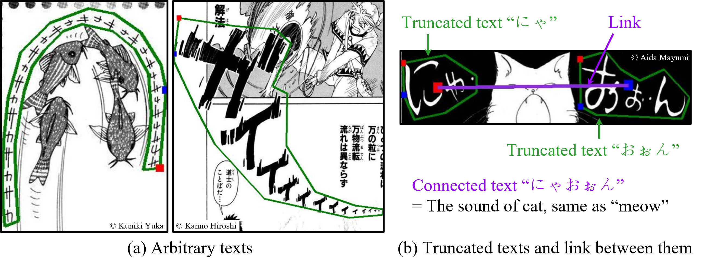

# COO: Comic Onomatopoeia Dataset for Recognizing Arbitrary or Truncated Texts
We provide COmic Onomatopoeia dataset (COO) and the source codes we used in our paper. <br>
We hope that this work will facilitate future work on recognizing various types of texts. <br>



<br>

## Dataset: Comic Onomatopoeia (COO)
We provide the [annotations of the COO](https://github.com/ku21fan/COO-Comic-Onomatopoeia/tree/main/COO-data/annotations). <br>

#### Prerequisites: Download Manga109 images
Following [the license of Manga109](http://www.manga109.org/en/download.html), the redistribution of the images of Manga109 is not permitted. <br> 
Thus, you should download the images of Manga109 via [Manga109 webpage](http://www.manga109.org/en/download.html). <br> 

After downloading, unzip `Manga109.zip` and then move `images` folder of Manga109 into [COO-data folder](https://github.com/ku21fan/COO-Comic-Onomatopoeia/tree/main/COO-data). <br>
= We need `images` folder in `COO-data` folder (i.e. `COO-data/images`) for preprocessing. 


#### Preprocessing for each model
1. Run the following command.
```
pip install Flask==2.0.2 Shapely==1.8.0 manga109api==0.3.1 pillow natsort lmdb opencv-python numpy tqdm
```

2. See the section `dataset` in each model folder.

<br>

## Codes
For text detection, we used ABCNetv2 and MTSv3. <br>
For text recognition, we used TRBA. <br> 
For link prediction, we used M4C-COO (a variant of M4C) <br>

<br>

## Leaderboard
We will list the results of SOTA methods that provide the official code. <br>
For the leaderboard, we report the performance of one pretrained model. <br>
Note that we report the average value of three trials in our paper. <br>


### Text detection
| Method | P | R | H | Official Code | Pretrained model |
| ---  |    ---    |    ---      |    ---     |   ---      |    ---      |
| DB (AAAI 2020) | 90.9 | 60.3 | 72.5 | [URL](https://github.com/MhLiao/DB) | [download](https://www.dropbox.com/s/b4zqiknn7i9kxqw/DB_pretrain_COO) | 
| PAN (ICCV 2019) | 88.4 | 58.6 | 70.4 | [URL](https://github.com/whai362/pan_pp.pytorch) | [download](https://www.dropbox.com/s/6vbc7m6o4695336/PAN_pretrain_COO.pth.tar) | 
| MTSv3 (ECCV 2020) | 70.1 | 66.0 | 68.0 | [URL](https://github.com/MhLiao/MaskTextSpotterV3) | [download](https://www.dropbox.com/s/u0rnep52nshfukx/MTSv3.pth) | 
| ABCNetv2 (TPAMI 2021) | 67.2 | 65.1 | 66.1 | [URL](https://github.com/aim-uofa/AdelaiDet/tree/master/configs/BAText) | [download](https://www.dropbox.com/s/cg63gsnf7741vjw/ABCNetv2.pth) | 

<br>

### Text recognition


<br>

### Link prediction

<br>


## Citation
When using annotations of comic onomatopoeia dataset (COO) or if you find this work useful for your research, please cite our paper.
```
@inproceedings{baek2022COO,
  title={COO: Comic Onomatopoeia Dataset for Recognizing Arbitrary or Truncated Texts},
  author={Baek, Jeonghun and Matsui, Yusuke and Aizawa, Kiyoharu},
  booktitle={Proceedings of the European Conference on Computer Vision (ECCV)},
  year={2022}
}
```

## Contact
Feel free to contact us if there is any question: Jeonghun Baek ku21fang@gmail.com

## License
For the dataset, annotation data of COO is licensed under a [CC BY 4.0](https://creativecommons.org/licenses/by/4.0/). <br>
The license of image data of Manga109 is described [here](http://www.manga109.org/en/download.html). <br>

For the codes made by us: MIT. <br>
After examining the licenses of original source codes of each method we used in our work, we found that the redistribution of source codes is permitted. <br>
Thus, to facilitate future work, we provide the source codes in this repository. <br>
Please let us know if there is a license issue with code redistribution. If so, we will remove the code and provide the instructions to reproduce our work.
