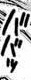
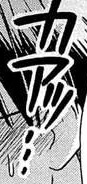
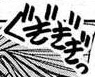
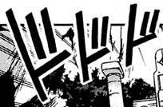
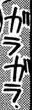
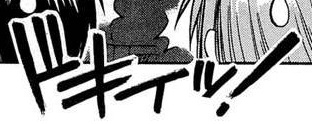
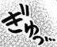
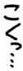
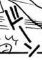
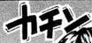

## Getting Started

### Installation
Recommended OS: Linux <br>
Install conda >= 4.11.0  (python >= 3.8) and then run following commands. <br>
(if your conda version is lower than 4.11.0, update conda first, with the command `conda update -n base -c defaults conda`)
```
conda create -n TRBA python=3.8 -y
conda activate TRBA

pip install torch==1.9.0+cu111 torchvision==0.10.0+cu111 -f https://download.pytorch.org/whl/torch_stable.html
pip install -r requirements.txt
```


### Dataset
Run [data_for_TRBA.ipynb](https://github.com/ku21fan/COO-Comic-Onomatopoeia/blob/main/COO-data/data_for_TRBA.ipynb) in the COO-data folder to make train/val/test data.

### Training
1. Train TRBA model with Rotation trick + SAR decoding
   ```
   CUDA_VISIBLE_DEVICES=0 python3 train.py --model_name TRBA --exp_name TRBA_Rot+SAR --SARdecode
   ```

2. Train TRBA model with Rotation trick + SAR decoding + half of batch filled with HardROI + 2D attn with image height 100
   ```
   CUDA_VISIBLE_DEVICES=0 python3 train.py --model_name TRBA --exp_name TRBA_Rot+SAR+HardROIhalf+2D \
   --SARdecode --imgH 100 --twoD --train_data ../COO-data/TRBA_data/ --select_data lmdb/train-hardROI/train
   ```

### Evaluation
1. Evaluate TRBA model with Rotation trick + SAR decoding
   ```
   CUDA_VISIBLE_DEVICES=0 python3 test.py --model_name TRBA --eval_type benchmark --SARdecode \
   --saved_model saved_models/TRBA_Rot+SAR/best_score.pth
   ```
2. Evaluate TRBA model with Rotation trick + SAR decoding + half of batch filled with HardROI + 2D attn with image height 100
   ```
   CUDA_VISIBLE_DEVICES=0 python3 test.py --model_name TRBA --eval_type benchmark --SARdecode --imgH 100 --twoD \
   --saved_model saved_models/TRBA_Rot+SAR+HardROIhalf+2D/best_score.pth
   ```

3. Evaluate with pretrained model [TRBA_Rot+SAR.pth](https://www.dropbox.com/s/ztbwhhimd34dryx/TRBA_Rot%2BSAR.pth)
   ```
   CUDA_VISIBLE_DEVICES=0 python3 test.py --model_name TRBA --eval_type benchmark --SARdecode \
   --saved_model TRBA_Rot+SAR.pth
   ```
4. Evaluate with pretrained model [TRBA_Rot+SAR+HardROIhalf+2D.pth](https://www.dropbox.com/s/bifm6a2rktl6s60/TRBA_Rot%2BSAR%2BHardROIhalf%2B2D.pth)
   ```
   CUDA_VISIBLE_DEVICES=0 python3 test.py --model_name TRBA --eval_type benchmark --SARdecode --imgH 100 --twoD \
   --saved_model TRBA_Rot+SAR+HardROIhalf+2D.pth
   ```


<h3 id="pretrained_models"> Run demo with pretrained model </h3>

1. [Download pretrained model](https://www.dropbox.com/sh/lx61z7gq5yzkp02/AAAEyzVuVqVy_-EvtqTOJTaXa?dl=0) <br>
There are 2 different models of TRBA

    Model | Description
    -- | --
    TRBA_Rot+SAR.pth | TRBA + Rotation trick + SAR decoding
    TRBA_Rot+SAR+HardROIhalf+2D.pth | TRBA + Rotation trick + SAR decoding + half of batch filled with HardROI + 2D attn with image height 100

2. Add image files to test into `demo_image/`
3. Run demo.py with [TRBA_Rot+SAR.pth](https://www.dropbox.com/s/ztbwhhimd34dryx/TRBA_Rot%2BSAR.pth)
   ```
   CUDA_VISIBLE_DEVICES=0 python3 demo.py --model_name TRBA --SARdecode \
   --image_folder demo_image/ --saved_model TRBA_Rot+SAR.pth
   ```
   or run demo.py with [TRBA_Rot+SAR+HardROIhalf+2D.pth](https://www.dropbox.com/s/bifm6a2rktl6s60/TRBA_Rot%2BSAR%2BHardROIhalf%2B2D.pth)
   ```
   CUDA_VISIBLE_DEVICES=0 python3 demo.py --model_name TRBA --SARdecode --twoD --imgH 100 \
   --image_folder demo_image/ --saved_model TRBA_Rot+SAR+HardROIhalf+2D.pth
   ```


#### prediction results
| demo images | [TRBA_Rot+SAR](https://www.dropbox.com/s/ztbwhhimd34dryx/TRBA_Rot%2BSAR.pth) | [TRBA_Rot+SAR+HardROIhalf+2D](https://www.dropbox.com/s/bifm6a2rktl6s60/TRBA_Rot%2BSAR%2BHardROIhalf%2B2D.pth) |
| ---         |     ---      |          --- |
|     |   ババッ | ババッ   |
|     |   カアッ・・・       | カアッ・・・        |
|     |   ぐぎぎぎ       | ぐぎぎぎっ       |
|     |   ドドド        | ドドド        |
|     |   ガラガラ     | ガガ   |
|     |   ドキえッ!     | ドキイッ!      |
|     |   ぎゅっ   | ぎゅっ・・・    |
|     |   こくっ・・・      | こくっ・・・       |
|     |   ドーン      | ドーン      |
|    |   カチン | カチン |


## Citation
Please consider citing this work in your publications if it helps your research.
```
@inproceedings{baek2019STRcomparisons,
  title={What Is Wrong With Scene Text Recognition Model Comparisons? Dataset and Model Analysis},
  author={Baek, Jeonghun and Kim, Geewook and Lee, Junyeop and Park, Sungrae and Han, Dongyoon and Yun, Sangdoo and Oh, Seong Joon and Lee, Hwalsuk},
  booktitle = {International Conference on Computer Vision (ICCV)},
  year={2019},
  pubstate={published},
  tppubtype={inproceedings}
}
```

## License
For the codes made by us: MIT. <br>
Original codes of deep-text-recognition-benchmark are licensed under [Apache License 2.0](https://github.com/clovaai/deep-text-recognition-benchmark#license).

## Acknowledgements
This implementation has been based on the repository [deep-text-recognition-benchmark](https://github.com/clovaai/deep-text-recognition-benchmark) and its advanced version [STR-Fewer-Labels](https://github.com/ku21fan/STR-Fewer-Labels).
